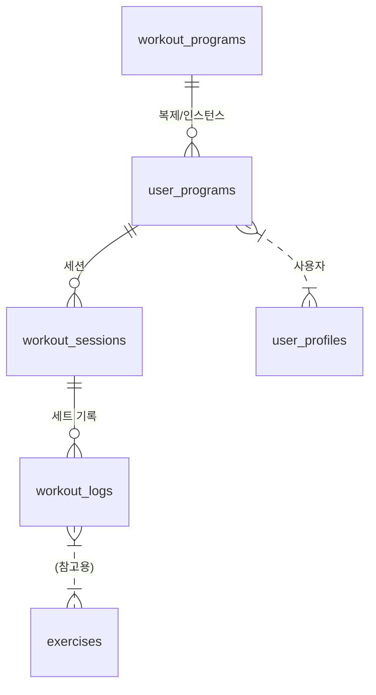

# JFIT 운동 관리 DB 구조 설명

## 1. 설계 목표
- **공식/운영자 프로그램**과 **사용자 커스텀 프로그램**을 모두 지원
- 사용자가 운동 루틴을 자유롭게 커스터마이즈(운동 추가/삭제/순서변경/이름변경 등)할 수 있도록 유연한 구조
- 세트별 운동 기록, 통계, 추천 등 다양한 확장성 확보

---

## 2. 주요 테이블 및 역할

### 2.1 workout_programs (공식/운영자 프로그램 마스터)
- 운영자가 제공하는 운동 프로그램(템플릿)
- exercises(마스터)와 조합하여 구성

### 2.2 user_programs (사용자별 프로그램 인스턴스)
- 사용자가 "프로그램 시작" 시 생성
- **운동 정의(JSON)**: 사용자가 커스터마이즈한 운동 리스트(이름, 세트, 반복수, 순서 등)를 JSON 컬럼에 저장
- 공식 프로그램을 복제하여 커스터마이즈 가능
- 예시 컬럼:
  - id (uuid, PK)
  - user_id (uuid, FK)
  - program_id (uuid, FK, 원본 프로그램)
  - started_at (date)
  - current_week (int)
  - current_day (int)
  - is_active (boolean)
  - completed_at (date)
  - **exercises_json (jsonb)** ← 운동 정의(아래 예시 참고)

#### exercises_json 예시
```json
[
  {
    "exercise_name": "벤치프레스",
    "sets": 4,
    "reps": "10",
    "order": 1,
    "custom_name": "내 벤치프레스",
    "custom_type": "strength"
  },
  {
    "exercise_name": "푸쉬업",
    "sets": 3,
    "reps": "15",
    "order": 2
  }
]
```

### 2.3 workout_sessions (운동 세션)
- 사용자가 Day 시작 시 생성
- user_programs의 운동 정의를 기반으로 세션 운동 리스트를 생성(필요시 세션별로 복사)
- 예시 컬럼:
  - id (uuid, PK)
  - user_program_id (uuid, FK)
  - session_date (date)
  - started_at (timestamptz)
  - ended_at (timestamptz)
  - is_completed (boolean)
  - **exercises_json (jsonb, 선택)** ← 세션별 운동 정의(커스터마이즈/수정 가능)

### 2.4 workout_logs (세트별 기록)
- 세트별 운동 기록(중량, 반복수, 완료여부 등)
- exercises.id 대신, user_programs/workout_sessions의 운동 정의 인덱스/이름/로컬ID로 연결
- 예시 컬럼:
  - id (uuid, PK)
  - session_id (uuid, FK)
  - exercise_index (int) 또는 exercise_name (string)
  - set_number (int)
  - weight (numeric)
  - reps (int)
  - completed (boolean)
  - logged_at (timestamptz)
  - (선택) exercise_id (uuid, exercises 마스터 참조용)

### 2.5 exercises (운동 마스터)
- 운동명, 타입, 난이도 등 마스터 데이터
- user_programs의 운동 정의와 매핑(참고용)

---

## 3. 커스터마이징/복제/이름변경/삭제 시나리오
- 사용자가 공식 프로그램을 "시작"하면 user_programs에 exercises_json 복사본 생성
- 사용자가 운동 추가/삭제/순서변경/이름변경 시 exercises_json만 수정
- workout_logs는 exercises_json의 인덱스/이름/로컬ID로 연결
- exercises.id는 통계/추천 등에서만 참고

---

## 4. ERD 요약 (관계도)


---

## 5. 장점
- 사용자 커스터마이징/복제/이름변경/삭제가 자유로움
- 마스터 exercises와 독립적으로 동작, 필요시만 매핑
- 공식/커스텀 프로그램 모두 일관된 구조로 관리

---

## 6. 참고
- 실제 마이그레이션/SQL/Flutter 모델/Repository/BLoC 설계는 별도 문서 참고
- 추가 확장(운동 그룹, superset, 노트 등)도 exercises_json에 자유롭게 추가 가능 